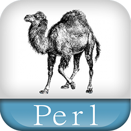

# Perl 脚本语言学习



* Perl 是 Practical Extraction and Report Language 的缩写，可翻译为 "**实用报表提取语言**"。
* Perl 是高级、通用、直译式、动态的程序语言。
* Perl 最初的设计者为拉里·沃尔（Larry Wall），于1987年12月18日发表。
* Perl 借用了C、sed、awk、shell脚本以及很多其他编程语言的特性。
* Perl 最重要的特性是Perl内部集成了正则表达式的功能，以及巨大的第三方代码库CPAN。

```
Something I hope you know before go into the coding~
* First, please watch or star this repo, I'll be more happy if you follow me.
* Bug report, questions and discussion are welcome, you can post an issue or pull a request.
```

## 教程

* <https://www.runoob.com/perl/perl-tutorial.html>

## 目录

* [perl简介](docs/perl简介.md)
* [perl环境安装](docs/perl环境安装.md)
* [perl基本语法](docs/perl基本语法.md)
* [perl数据类型](docs/perl数据类型.md)
* [perl变量](docs/perl变量.md)
* [perl标量](docs/perl标量.md)
* [perl数组](docs/perl数组.md)
* [perl哈希](docs/perl哈希.md)
* [perl条件语句](docs/perl条件语句.md)
* [perl循环](docs/perl循环.md)
* [perl运算符](docs/perl运算符.md)
* [perl时间日期](docs/perl时间日期.md)
* [perl函数](docs/perl函数.md)
* [perl引用](docs/perl引用.md)
* [perl格式化输出](docs/perl格式化输出.md)
* [perl文件操作](docs/perl文件操作.md)
* [perl目录操作](docs/perl目录操作.md)
* [perl错误处理](docs/perl错误处理.md)
* [perl特殊变量](docs/perl特殊变量.md)
* [perl正则表达式](docs/perl正则表达式.md)
* [perl面向对象](docs/perl面向对象.md)
* [perl Socket编程](docs/perlSocket编程.md)
* [perl包和模块](docs/perl包和模块.md)
* [perl集成管理](docs/perl集成管理.md)


---
