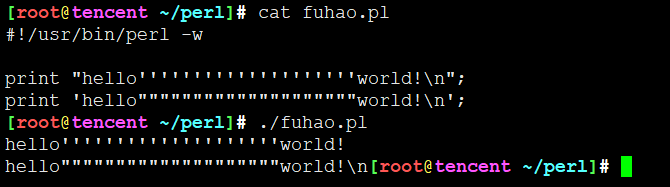
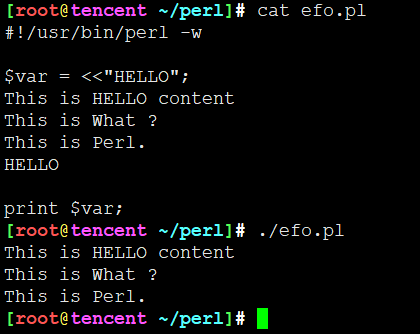

# perl基本语法

* Perl借用了C、sed、awk、shell脚本以及很多其他编程语言的特性，语法与这些语言有些类似，也有自己的特点。
* Perl 程序有声明与语句组成，程序自上而下执行，包含了循环，条件控制，每个语句以分号 (;) 结束。
* Perl 语言没有严格的格式规范，你可以根据自己喜欢的风格来缩进。


## 第一个 perl 程序

1. 交互式编程
你可以在命令行中使用 ```-e``` 选项来输入语句来执行代码，实例如下：
```
$ perl -e 'print "Hello World\n"'
```

输入以上命令，回车后，输出结果为：
Hello World

2. 脚本式编程

将以下代码放到 hello.pl 文件中：

```
#!/usr/bin/perl

# 输出 "Hello, World"
print "Hello, world\n";
```

代码中 ```/usr/bin/perl``` 是 perl 解释器的路径。在执行该脚本前要先确保文件有可执行权限，我们可以先将文件权限修改为 0755 ：
```
$ chmod 0755 hello.pl
$ ./hello.pl
Hello, world                   # 输出结果
```

print 也可以使用括号来输出字符串，以下两个语句输出相同的结果：
```
print("Hello, world\n");
print "Hello, world\n";
```

## perl 脚本文件

perl 代码可以写在一个文本文件中，以 **.pl、.PL** 作为后缀。

**文件名可以包含数字，符号和字母，但不能包含空格，可以使用下划线（_）来替代空格。**

一个简单的Perl 文件名：
```
run_oob.pl
```

但其实Linux下只要具备可执行权限，并且文件开头标明使用解释器，总能够执行，不拘泥与文件命名

## perl 注释

使用注释使你的程序易读，这是好的编程习惯。

**perl 注释的方法为在语句的开头用字符#**

```
# 这一行是 perl 中的注释
```
perl 也支持多行注释，最常用的方法是使用 **POD(Plain Old Documentations)** 来进行多行注释。
方法如下:

实例
```
#!/usr/bin/perl

# 这是一个单行注释
print "Hello, world\n";

=pod 注释
这是一个多行注释
这是一个多行注释
这是一个多行注释
这是一个多行注释
=cut
```

执行以上程序，输出结果为：
```
Hello, world
```
注意：

1. =pod、 =cut只能在行首。
2. 以=开头，以=cut结尾。
3. =后面要紧接一个字符，=cut后面可以不用。

这种注释太麻烦了，相比其他语言


## Perl 中的空白

**Perl 解释器不会关心有多少个空白**，以下程序也能正常运行：

实例
```
#!/usr/bin/perl

print       "Hello, world\n";
```
执行以上程序，输出结果为：
```
Hello, world
```

但是**如果空格和分行出现在字符串内，他会原样输出**：

实例
```
#!/usr/bin/perl

# 会输出分行
print "Hello
          world\n";
```
执行以上程序，输出结果为：
```
Hello
          world
```

1. 所有类型的空白如：空格，tab ，空行等如果在引号外解释器会忽略它
2. 引号内的字符串会原样输出。

## 单引号和双引号

perl 输出字符串可以使用单引号和双引号，如下所示：

实例
```
#!/usr/bin/perl

print "Hello, world\n";    # 双引号
print 'Hello, world\n';    # 单引号
```
输出结果如下：
```
Hello, world
Hello, world\n
```

从结果中我们可以看出，双引号 \n 输出了换行，而单引号没有。

Perl双引号和单引号的区别:

1. 双引号可以正常解析一些转义字符与变量
2. 单引号无法解析会原样输出。

实例
```
#!/usr/bin/perl

$a = 10;
print "a = $a\n";
print 'a = $a\n';
```
输出结果如下：
```
a = 10
a = $a\n
```
这点跟shell脚本编程一样一样的


## Here 文档

Here文档又称作**heredoc、hereis、here-字串或here-脚本**，是一种在命令行shell（如sh、csh、ksh、bash、PowerShell和zsh）和程序语言（像Perl、PHP、Python和Ruby）里定义一个字串的方法。

使用概述：

1.**必须后接分号**，否则编译通不过。
2.END可以用任意其它字符代替，只需保证结束标识与开始标识一致。
3.**结束标识必须顶格独自占一行**(即必须从行首开始，前后不能衔接任何空白和字符)。
4.**开始标识可以不带引号号或带单双引号，不带引号与带双引号效果一致，解释内嵌的变量和转义符号，带单引号则不解释内嵌的变量和转义符号。**
5.当内容需要内嵌引号（单引号或双引号）时，不需要加转义符。
```
#!/usr/bin/perl

$a = 10;
$var = <<"EOF";
这是一个 Here 文档实例，使用双引号。
可以在这输如字符串和变量。
例如：a = $a
EOF
print "$var\n";

$var = <<'EOF';
这是一个 Here 文档实例，使用单引号。
例如：a = $a
EOF
print "$var\n";
```
执行以上程序输出结果为：
```
这是一个 Here 文档实例，使用双引号。
可以在这输如字符串和变量。
例如：a = 10

这是一个 Here 文档实例，使用单引号。
例如：a = $a
```

* 这不就是shell脚本里的EOF输入么

## 转义字符

如果我们需要输出一个特殊的字符，可以使用**反斜线（\）**来转义，例如输出美元符号($):

实例
```
#!/usr/bin/perl

$result = "菜鸟教程 \"runoob\"";
print "$result\n";
print "\$result\n";
```
执行以上程序输出结果为：
```
[root@tencent ~/perl]# ./jiaocheng.pl
菜鸟教程 "runoob"
$result
```


## Perl 标识符

1. Perl 标识符是用户编程时使用的名字，在程序中使用的变量名，常量名，函数名，语句块名等统称为标识符。
2. 标识符组成单元：英文字母（a~z，A~Z），数字（0~9）和下划线（_）。
3. 标识符由**英文字母或下划线开头**，**不能由数字开头**
3. 标识符**区分大小写**，$runoob 与 $Runoob 表示两个不同变量。
4. 任何标识符都要做到见名知意

## perl 中的单引号和双引号

1. 双中有双，单中有单都需要``` \ ```转义。
2. **双中有单或单中有双均不需要转义**
3. 单引号直接了当，引号内是什么就显示什么，双引号则需要考虑转义或变量替换等。



## 不一定就是EOF

EOF在这里通俗讲就是一个标记，他用来标记一段文字（一般都是多行的，省得编码麻烦，用"<<"加上一个标记就可以把一大段代码存入到一个变量中去了）

```$a=<< “EOF” ```的意思就是说：下一行开始，直到遇见“EOF”为止，所有的字符都按照指定的格式存入变量a中。

你可以用EEE，MAMA等等其他的名字都可以，就是一个标记而已。他的作用就是简化输入。



---
