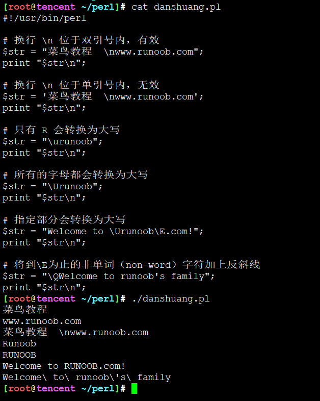

<!-- MDTOC maxdepth:6 firsth1:1 numbering:0 flatten:0 bullets:1 updateOnSave:1 -->

- [perl数据类型](#perl数据类型)   
   - [标量-$](#标量)   
   - [数组-@](#数组)   
   - [哈希-%](#哈希-%)   
   - [数字字面量](#数字字面量)   
      - [整型](#整型)   
      - [浮点数](#浮点数)   
      - [字符串](#字符串)   
   - [转义字符](#转义字符)   

<!-- /MDTOC -->
# perl数据类型

1. Perl 是一种弱类型语言，所以变量不需要指定类型，Perl 解释器会根据上下文自动选择匹配类型。
2. Perl 有三个基本的数据类型：标量、数组、哈希。

以下是这三种数据类型的说明：

## 标量-$

标量是 Perl 语言中最简单的一种数据类型。这种数据类型的变量可以是数字，字符串，浮点数，不作严格的区分。在使用时在变量的名字前面加上一个 $，表示是标量。例如：
```
$myfirst=123;　    #数字123　
$mysecond="123";   #字符串123　
```

## 数组-@

数组变量以字符``` @ ```开头，索引从 0 开始，如：```@arr=(1,2,3)```

```
@arr=(1,2,3)
```

##	哈希-%
哈希是一个无序的 key/value 对集合。可以使用键作为下标获取值。哈希变量以字符``` % ```开头。

```
%h=('a'=>1,'b'=>2);
```

## 数字字面量

### 整型

Perl 实际上把整数存在你的计算机中的浮点寄存器中，所以实际上被当作浮点数看待。

在多数计算机中，浮点寄存器可以存贮约 16 位数字，长于此的被丢弃。整数实为浮点数的特例。

整型变量及运算：
```
$x = 12345;
if (1217 + 116 == 1333) {
    # 执行代码语句块
}
```

8 进制和 16 进制数：**8 进制以 0 开始，16 进制以 0x 开始**。例如：

```
$var1 = 047;    # 等于十进制的39
$var2 = 0x1f;   # 等于十进制的31
```

### 浮点数

浮点数数据如：11.4 、 -0.3 、.3 、 3. 、 54.1e+02 、 5.41e03。

**浮点寄存器通常不能精确地存贮浮点数，从而产生误差**，在运算和比较中要特别注意。

指数的范围通常为 -309 到 +308。

实例
```
#!/usr/bin/perl

$value = 9.01e+21 + 0.01 - 9.01e+21;
print ("第一个值为：", $value, "\n");
$value = 9.01e+21 - 9.01e+21 + 0.01;
print ("第二个值为:", $value, "\n");
```

执行以上程序，输出结果为：

```
第一个值为：0
第二个值为:0.01
```

### 字符串

* Perl 中的字符串使用一个标量来表示，定义方式和 c 很像，但是在 Perl 里面字符串不是用 \0 来表示结束的。
* Perl 双引号和单引号的区别: 双引号可以正常解析一些转义字符与变量，而单引号无法解析会原样输出。
* 但是用**单引号定义可以使用多行文本**

如下所示：

```
#!/usr/bin/perl

$var='这是一个使用

多行字符串文本

的例子';

print($var);
```

执行以上程序，输出结果为：
```
这是一个使用

多行字符串文本

的例子
```

## 转义字符

| 转义字符 | 含义   |
| -------- | ------ |
| \\       | 反斜线 |
| \'       | 单引号 |
| \"       | 双引号 |
| \b       | 退格   |
| \n       | 换行符 |
| \r       | 回车   |

 

---
