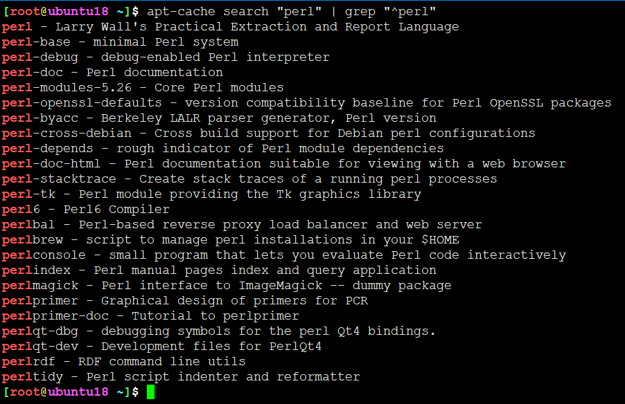
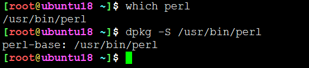
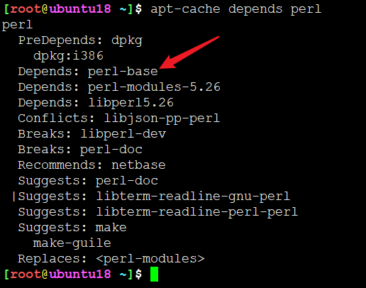
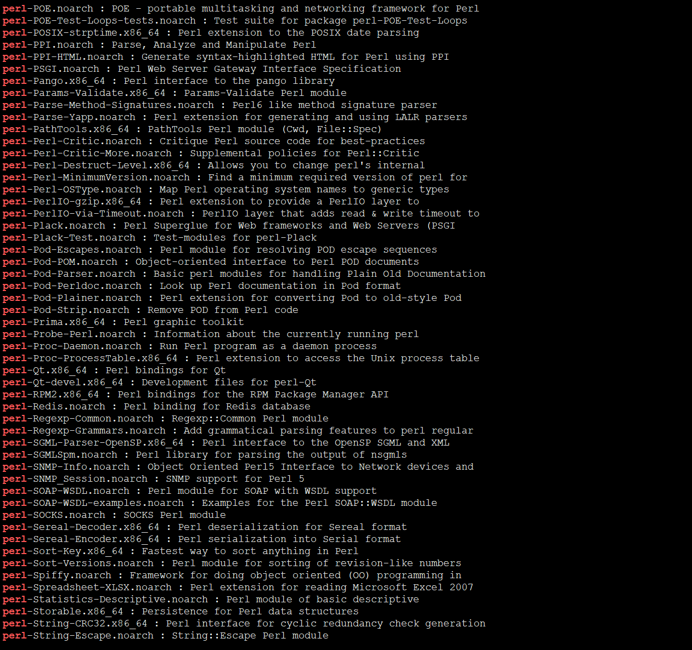
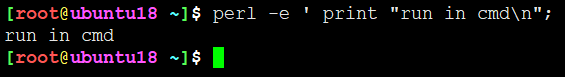
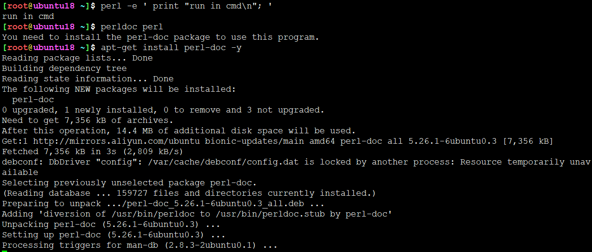
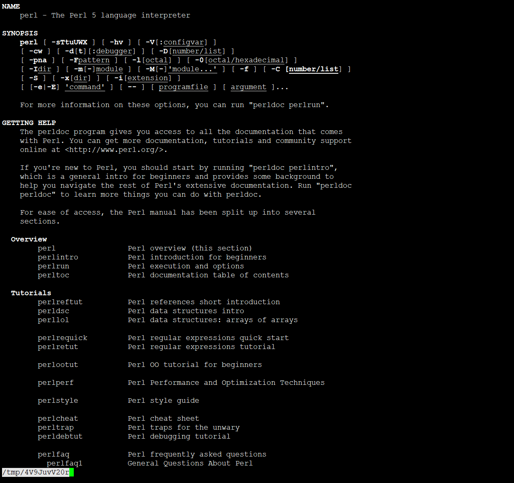

<!-- MDTOC maxdepth:6 firsth1:1 numbering:0 flatten:0 bullets:1 updateOnSave:1 -->

- [perl环境安装](#perl环境安装)   
   - [Debian/Ubuntu环境下安装](#debianubuntu环境下安装)   
   - [Redhat/CentOS环境下安装](#redhatcentos环境下安装)   
   - [perl命令](#perl命令)   
   - [perl帮助](#perl帮助)   
   - [perl脚本](#perl脚本)   

<!-- /MDTOC -->
# perl环境安装

## Debian/Ubuntu环境下安装








```
sudo apt-get install perl -y
```

## Redhat/CentOS环境下安装



yum包管理器将perl诸多包拆分开来

```
sudo yum install perl -y
```


## perl命令



* 添加参数 -e 后，可以直接在cmd中运行perl
* 类似于Python命令，可以脚本，也可以交互式运行

```
[root@ubuntu18 ~]$ perl -h
Usage: perl [switches] [--] [programfile] [arguments]
  -0[octal]         specify record separator (\0, if no argument)
  -a                autosplit mode with -n or -p (splits $_ into @F)
  -C[number/list]   enables the listed Unicode features
  -c                check syntax only (runs BEGIN and CHECK blocks)
  -d[:debugger]     run program under debugger
  -D[number/list]   set debugging flags (argument is a bit mask or alphabets)
  -e program        one line of program (several -e's allowed, omit programfile)
  -E program        like -e, but enables all optional features
  -f                don't do $sitelib/sitecustomize.pl at startup
  -F/pattern/       split() pattern for -a switch (//'s are optional)
  -i[extension]     edit <> files in place (makes backup if extension supplied)
  -Idirectory       specify @INC/#include directory (several -I's allowed)
  -l[octal]         enable line ending processing, specifies line terminator
  -[mM][-]module    execute "use/no module..." before executing program
  -n                assume "while (<>) { ... }" loop around program
  -p                assume loop like -n but print line also, like sed
  -s                enable rudimentary parsing for switches after programfile
  -S                look for programfile using PATH environment variable
  -t                enable tainting warnings
  -T                enable tainting checks
  -u                dump core after parsing program
  -U                allow unsafe operations
  -v                print version, patchlevel and license
  -V[:variable]     print configuration summary (or a single Config.pm variable)
  -w                enable many useful warnings
  -W                enable all warnings
  -x[directory]     ignore text before #!perl line (optionally cd to directory)
  -X                disable all warnings

Run 'perldoc perl' for more help with Perl.
```


## perl帮助

Debian/Ubuntu环境下，安装依赖包后使用perl官方帮助信息



```
sudo apt-get install perl-doc -y
```



## perl脚本

1. 在 perl 的路径上也可以加上 ```-w```，可以显示程序中出现的一些警告，尽管可能不影响程序的执行结果，方便我们修改我们的程序，例如：

```
#!/usr/bin/perl -w
```

其中```#!/usr/bin/perl```需要参考自己的 perl 路径。+

```
[root@tencent ~/perl]# which perl
/usr/bin/perl
```
