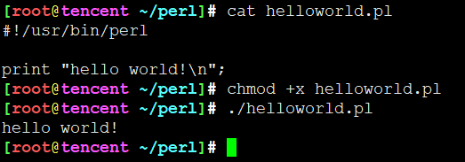

# perl简介





## 什么是 Perl

* Perl，一种功能丰富的计算机程序语言，运行在超过100种计算机平台上，适用广泛，从大型机到便携设备，从快速原型创建到大规模可扩展开发。
* Perl 语言的应用范围很广，除**CGI(Common Gateway Interface，译作“通用网关接口”)**以外，Perl被用于图形编程、系统管理、网络编程、金融、生物以及其他领域。由于其灵活性，**Perl被称为脚本语言中的瑞士军刀**。
* Perl是由Larry Wall设计的，并由他不断更新和维护的编程语言。
* Perl具有高级语言（如C）的强大能力和灵活性。事实上，你将看到，它的许多特性是从C语言中借用来的。
* Perl与脚本语言一样，Perl不需要编译器和链接器来运行代码，你要做的只是写出程序并告诉Perl来运行而已。这意味着Perl对于小的编程问题的快速解决方案和为大型事件创建原型来测试潜在的解决方案是十分理想的。
* Perl提供脚本语言（如sed和awk）的所有功能，还具有它们所不具备的很多功能。Perl还支持sed到Perl及awk到Perl的翻译器。

简而言之，**Perl像C一样强大，像awk、sed等脚本描述语言一样方便。**

## Perl 优点

* 相比C、Pascal这样的"高级"语言而言，Perl语言直接提供泛型变量、动态数组、Hash表等更加便捷的编程元素。
Perl具有动态语言的强大灵活的特性，并且还从C/C++、Basic、Pascal等语言中分别借鉴了语法规则，从而提供了许多冗余语法。
* 在统一变量类型和掩盖运算细节方面，Perl做得比其他高级语言(如：Python）更为出色。
* 由于从其他语言大量借鉴了语法，使得从其他编程语言转到Perl语言的程序员可以迅速上手写程序并完成任务，这使得Perl语言是一门容易用的语言。
* Perl 是可扩展的，我们可以通过**CPAN（"the Comprehensive Perl Archive Network"全面的 Perl 存档网络）**中心仓库找到很多我们需要的模块。
* Perl 的 mod_perl 的模块允许 Apache web 服务器使用 Perl 解释器。

## Perl 缺点

* 也正是因为Perl的灵活性和"过度"的冗余语法，也因此获得了仅写（write-only）的"美誉"，因为Perl程序可以写得很随意（例如，变量不经声明就可以直接使用），但是可能少写一些字母就会得到意想不到的结果（而不报错），许多Perl程序的代码令人难以阅读，实现相同功能的程序代码长度可以相差十倍百倍，这就令程序的维护者（甚至是编写者）难以维护。
* 同样的，因为Perl这样随意的特点，可能会导致一些Perl程序员遗忘语法，以至于不得不经常查看Perl手册。
* 建议的解决方法是在程序里使用```use strict;```以及```use warnings;```，并统一代码风格，使用库，而不是自己使用"硬编码"。Perl同样可以将代码书写得像Python或Ruby等语言一样优雅。
* 很多时候，perl.exe进程会占用很多的内存空间，虽然只是一时，但是感觉不好。
